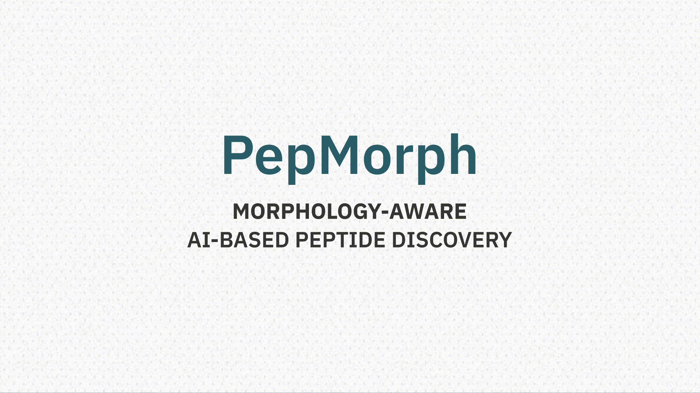

# PepMorph: Morphology-Specific Peptide Discovery via Masked Conditional Generative Modeling



This repository implements the **PepMorph** pipeline for the paper *Morphology-Specific Peptide Discovery via Masked Conditional Generative Modeling* - Costa & Zavadlav, (2025). It provides a conditional, mask-aware CVAE for peptide generation and utilities to train, validate, and compare generated sequences against morphology targets.

## Abstract

> Peptide self-assembly prediction offers a powerful bottom-up strategy for designing biocompatible, low-toxicity materials for large-scale synthesis in a broad range of biomedical and energy applications. However, screening the vast sequence space for categorization of aggregate morphology remains intractable. We introduce PepMorph, an end-to-end peptide discovery pipeline that generates novel sequences that are not only prone to aggregate but whose self-assembly is steered toward fibrillar or spherical morphologies by conditioning on isolated peptide descriptors that serve as morphology proxies. To this end, we compiled a new dataset by leveraging existing aggregation propensity datasets and extracting geometric and physicochemical descriptors. This dataset is then used to train a Transformer-based Conditional Variational Autoencoder with a masking mechanism, which generates novel peptides under arbitrary conditioning. After filtering to ensure design specifications and validation of generated sequences through coarse-grained molecular dynamics simulations, PepMorph yielded 83% success rate under our CG-MD validation protocol and morphology criterion for the targeted class, showcasing its promise as a framework for application-driven peptide discovery.

---

## Repository structure

```
├── data/
│   ├── raw/                      # source datasets + input FASTA (peptides.fst)
│   ├── processed/                # merged/normalized descriptor CSVs
│   └── splits/                   # deterministic train/val/test indices
├── artifacts/
│   ├── data_figs/                # dataset figures
│   ├── descriptor_calc/          # descriptor-calc logs/timings
│   ├── models/                   # pretrained weights (AP predictor, masked CVAE)
│   ├── validation/               # validation outputs (figs/results/gen_peptides)
│   ├── md_sims/                  # validation artifacts from the paper (MD sims, analysis)
│   └── legacy_runs/              # older outputs moved out of working dirs
├── notebooks/
│   └── *.ipynb                   # exploratory notebooks
├── src/
│   └── pepmorph/
│       ├── __init__.py
│       ├── shared/
│       │   └── plot_style.py     # shared plotting style
│       ├── scripts/              # dataset merge/analysis utilities
│       ├── descriptor_calc/      # PEP-FOLD/descriptor generation pipeline
│       ├── modeling/             # AP predictor + CVAE training/validation
│       └── md_sims/              # CG robustness analysis scripts
├── README.md
├── environment.yml               # pinned Python dependencies
```

---

## Quickstart

1) Create the environment:
```bash
conda env create -f environment.yml
conda activate pepmorph
```
If you need CPU-only, remove `pytorch-cuda` from `environment.yml` and reinstall.

2) Prepare the processed dataset:
```bash
python src/pepmorph/scripts/merge.py
```

3) Create deterministic splits (stratified by length, seed=42):
```bash
python src/pepmorph/scripts/make_splits.py
```

4) Train the AP/SA predictor:
```bash
python src/pepmorph/modeling/ap_model/ap_sa_pred.py --config src/pepmorph/modeling/ap_model/config.yaml
```

5) Train the masked CVAE (all hyperparameters in config):
```bash
python src/pepmorph/modeling/masked_cvae/train.py --config src/pepmorph/modeling/masked_cvae/config.yaml
```

6) Generate peptides and evaluate:
```bash
python src/pepmorph/modeling/validation/generate.py --mode all
python src/pepmorph/modeling/validation/evaluate_novelty_diversity_sim.py
python src/pepmorph/modeling/validation/validation_plotting.py
```

Outputs go to `artifacts/validation/{gen_peptides,results,figs}`.

---

## Reproducibility notes

- **Environment**: `environment.yml` pins all major dependencies (Torch, ESM, numpy/pandas/sklearn, plotting).
- **Splits**: `data/splits/*.txt` are deterministic (seed=42), generated by `src/pepmorph/scripts/make_splits.py`.
- **Seeds**: training/evaluation scripts accept `--seed` and call a shared deterministic seed routine.
- **Training schedule**: CVAE hyperparameters are in `src/pepmorph/modeling/masked_cvae/config.yaml` and logged to `artifacts/models/masked_cvae/config_used.yaml` on each run.
- **AP model config**: AP hyperparameters are in `src/pepmorph/modeling/ap_model/config.yaml` and logged to `artifacts/models/ap_model/config_used.yaml` on each run.
- **Checkpoints**: pretrained weights live in `artifacts/models/{ap_model,masked_cvae}`.

Key CVAE settings (paper defaults):
- Latent dimension: 24
- Encoder/decoder: 2-layer Transformer, hidden size 256, 8 heads, dropout 0.1
- KL schedule: cyclic weight (base 0.05) with 10 cycles and 100 warmup epochs
- Mask probability: 0.5 (stochastic descriptor masking)
- Random peptide augmentation: 15,000 per epoch
- Batch size: 2048, epochs: 250, learning rate: 1e-3, weight decay: 1e-4

---

## Citation

If you use PepMorph, please cite:

```bibtex
@misc{costa2025morphologyspecificpeptidediscoverymasked,
      title={Morphology-Specific Peptide Discovery via Masked Conditional Generative Modeling}, 
      author={Nuno Costa and Julija Zavadlav},
      year={2025},
      eprint={2509.02060},
      archivePrefix={arXiv},
      primaryClass={q-bio.BM},
      url={https://arxiv.org/abs/2509.02060}, 
}
```
---

## Contact

For questions regarding implementation, please send an email to nuno.costa@tum.de
